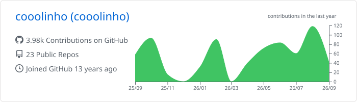
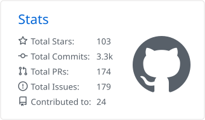
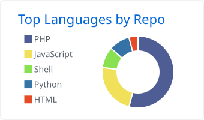
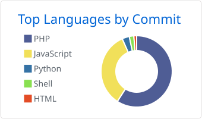
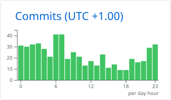

<!-- Alternative zum Banner: eigener Avatar

-->

---

## 👋 About me

- 🧑‍💻 Backend developer with a focus on **PHP**, **Symfony** and **Laravel**
- 🛒 E-commerce & CMS work with **Shopware 6** and **Contao**
- ⚙️ I build **reusable bundles**, **boilerplates** and **developer tooling**
- 🐍 Automation and side quests in **Python** (scrapers, media tooling, home automation)
- 🐳 Everything runs in **Docker** — local parity is non-negotiable
- ⚽ Maintaining club software for **TSV Großenkneten** (squad planner, cashbox, court booking)

---

## 🛠️ Tech stack

**Languages**

**Frameworks & platforms**

**Infrastructure & tools**

---

## 📊 GitHub stats

<!--
  Diese Karten werden von .github/workflows/profile-summary-cards.yml taeglich
  erzeugt und in dieses Repo committet. Kein externer Runtime-Dienst.
-->

<picture>
  <source media="(prefers-color-scheme: dark)" srcset="profile-summary-card-output/github_dark/0-profile-details.svg" />
  
</picture>

<picture>
  <source media="(prefers-color-scheme: dark)" srcset="profile-summary-card-output/github_dark/3-stats.svg" />
  
</picture>
<picture>
  <source media="(prefers-color-scheme: dark)" srcset="profile-summary-card-output/github_dark/1-repos-per-language.svg" />
  
</picture>
<picture>
  <source media="(prefers-color-scheme: dark)" srcset="profile-summary-card-output/github_dark/2-most-commit-language.svg" />
  
</picture>
<picture>
  <source media="(prefers-color-scheme: dark)" srcset="profile-summary-card-output/github_dark/4-productive-time.svg" />
  
</picture>

---

## 🐍 Contribution activity

<!-- Erzeugt von .github/workflows/snake.yml, liegt im Branch "output". -->

<picture>
  <source media="(prefers-color-scheme: dark)" srcset="https://raw.githubusercontent.com/cooolinho/cooolinho/output/github-snake-dark.svg" />
  
</picture>

---

## 🚀 Selected projects

| Project | What it is |
| --- | --- |
| [symfony-file-importer-bundle](https://github.com/cooolinho/symfony-file-importer-bundle) | Reusable Symfony bundle for importing structured files |
| [symfony-security-bundle](https://github.com/cooolinho/symfony-security-bundle) | Drop-in security layer for Symfony applications |
| [laravel-filament-template](https://github.com/cooolinho/laravel-filament-template) | Opinionated Laravel + Filament starter |
| [docker-symfony](https://github.com/cooolinho/docker-symfony) | Dockerised Symfony development environment |
| [tsv-squad-planner](https://github.com/cooolinho/tsv-squad-planner) | Squad planning tool for an amateur football club |

---

## 📫 Get in touch

<!-- Passe die folgenden Links an oder entferne sie -->

